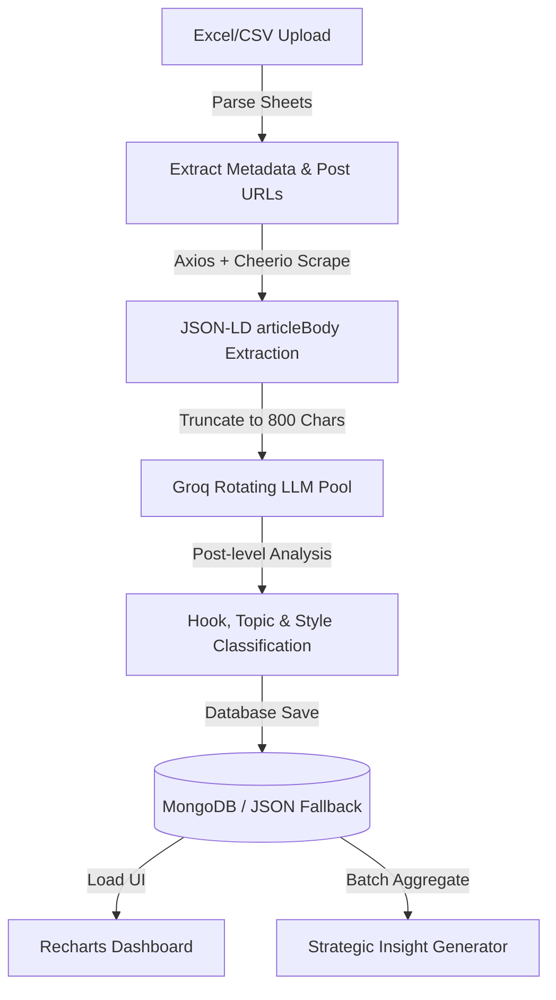

# 🚀 LinkedIn Hooks & Post Performance Analyzer

An advanced, full-stack Next.js application built to ingest, analyze, humanize, and schedule high-converting LinkedIn content. By parsing your exported LinkedIn analytics, scraping live post content, and processing them through a resilient AI pipeline, this tool extracts performance patterns and helps you draft posts that bypass AI detectors and resonate with readers.

---

## 📖 Table of Contents

- [Core Features](#-core-features)
- [🛠️ Technology Stack](#️-technology-stack)
- [🧩 Architecture & Ingestion Pipeline](#-architecture--ingestion-pipeline)
- [🤖 Resilient AI Engine & Rate-Limit Rotation](#-resilient-ai-engine--rate-limit-rotation)
- [✍️ Hook Skeletons & Generative Post Writer](#️-hook-skeletons--generative-post-writer)
- [🛡️ De-AI Humanization & 10-Point Audit Engine](#️-de-ai-humanization--10-point-audit-engine)
- [💾 Hybrid Database Layer with Auto-Fallback](#-hybrid-database-layer-with-auto-fallback)
- [📁 Project Structure](#-project-structure)
- [⚙️ Environment Configuration](#️-environment-configuration)
- [🚀 Quick Start & Installation](#-quick-start--installation)
- [💡 Extending the Project](#-extending-the-project)

---

## ⚡ Core Features

*   **📊 Multi-Sheet Ingestion**: Direct drag-and-drop support for exporting LinkedIn performance sheets (`ENGAGEMENT`, `FOLLOWERS`, `DEMOGRAPHICS`, and `TOP POSTS` worksheets).
*   **🕷️ High-Speed Metadata Scraper**: Direct scraping of post content via meta-tag and JSON-LD parsing (extracts `articleBody` / `description`), running ~10x faster than headless browser automation.
*   **🤖 Smart AI Classification**: Automated post hook extraction, style taxonomy categorization (10 distinct styles), and topic classification (13 topics).
*   **📉 Analytics Dashboard**: Interactive graphs and sorting systems displaying average impressions per hook/topic, engagement rates (ER%), follower growth charts, and demographic breakdowns.
*   **🔍 AI Patterns & Actionable Insights**: Strategic summaries extracting what worked, what failed, and generating personalized copy recommendations.
*   **✍️ Programmatic Post Writer**: Generative interface powered by proven 2026 viral copywriting formulas (e.g., Odd-Precision Money Ledger, Platform Risk Anaphora, Paid-vs-Free Reversal).
*   **🛡️ Multi-Tier De-AI Humanizer**: A refined rewriting tool that strips corporate AI speak (e.g., "leverage", "utilize", "deep dive"), structures text for visual flow, and injects first-person sensory details.
*   **📋 10-Point Algorithmic Auditor**: Automatic validation checking drafts against character length sweet spots (900-1,300), viewport limits (hook visible in first 2 lines), hashtag counts, and teaser language.
*   **💾 Hybrid Database Resilience**: Built-in Mongo client via Prisma, with automated, transparent fallback to local JSON database storage (`data/local_db.json`) if credentials or DB servers are offline.

---

## 🛠️ Technology Stack

| Layer | Technologies Used |
| :--- | :--- |
| **Framework** | Next.js 16.2 (App Router), React 19, TypeScript |
| **Styling** | Tailwind CSS v4, PostCSS, Lucide Icons |
| **Database** | MongoDB, Prisma ORM 7.8 (with Auto-Fallback storage) |
| **Analytics & UI** | Recharts (for dynamic graphs), TanStack Table |
| **LLM Provider** | Groq Cloud SDK (rotating free model pool) |
| **Parser & Scraper**| SheetJS (xlsx package), Axios, Cheerio |

---

## 🧩 Architecture & Ingestion Pipeline

The project implements a zero-overhead, Puppeteer-free scraping and processing pipeline:



1.  **Ingest**: The app parses your LinkedIn spreadsheet upload using [xlsx-parser.ts](file:///H:/linkedin-hooks-analyzer/src/lib/xlsx-parser.ts).
2.  **Scrape**: It pulls raw post texts from post URLs using a fast meta-scraping utility in [scraper.ts](file:///H:/linkedin-hooks-analyzer/src/lib/scraper.ts) using Cheerio.
3.  **Process**: The [ai.ts](file:///H:/linkedin-hooks-analyzer/src/lib/ai.ts) wrapper splits the analytical payload and uses Groq models to tag attributes.
4.  **Save**: It updates post indices inside the database, ready to render on the client dashboard.

---

## 🤖 Resilient AI Engine & Rate-Limit Rotation

To enable zero-cost processing using Groq's free tier, the LLM client in [ai.ts](file:///H:/linkedin-hooks-analyzer/src/lib/ai.ts) uses a **rotating model pool** with built-in backoff.

### Rate Limit Mitigation
*   **Rotation Pool**: Every request cycles through a different model in the pool:
    1.  `llama-3.1-8b-instant` (Ultra-fast, low token cost)
    2.  `gemma2-9b-it` (Google Gemma 2, strict JSON compliance)
    3.  `llama3-8b-8192` (Meta Llama 3, robust baseline fallback)
*   **Auto-Retry & Backoff**: If any model encounters rate-limiting (`429`) or server overload (`503`), the client automatically rotates to the next model and delays the retry using exponential backoff (starting at `1200ms` up to `15000ms`).
*   **Inter-Post Throttling**: A constant `2000ms` delay is added between post updates to stay within request-per-minute (RPM) limits.

### Zero-Cost Heuristic Fallback
If the network is offline or the Groq API key is completely exhausted, the system automatically falls back to static regex classification to ensure the pipeline never breaks:
*   **Hook Heuristics**: Matches question marks, negative trigger words ("fail", "mistake"), chronological indicators ("years ago"), or code words to assign an archetype.
*   **Topic Heuristics**: Inspects keyword density (e.g., containing "next.js" triggers the Next.js topic tag; "artificial" or "gpt" triggers the AI tag).

---

## ✍️ Hook Skeletons & Generative Post Writer

The system's generative post writer ([src/app/post-writer/page.tsx](file:///H:/linkedin-hooks-analyzer/src/app/post-writer/page.tsx)) features preloaded templates based on top-performing LinkedIn structures from 2025-2026:

| Code | Formula Archetype | Description | Best For |
| :--- | :--- | :--- | :--- |
| **F1** | Platform Risk Anaphora | Repetitive problem phrasing contrasting a systemic shift | Niche trends / Product pivots |
| **F2** | R.I.P. Obituary | Announcing the death of a traditional method | Industry shifts & hot takes |
| **F3** | Year-over-Year Pivot | Contrast-rich timeline tracking a founder's journey | Personal branding / Growth logs |
| **F4** | Time-Anchor Confession | Post starting with a specific vulnerable timestamp | Vulnerability & high engagement |
| **F5** | Self-Proving Meta | Testing a thesis in public and reporting results live | Build-in-public / Case studies |
| **F7** | Odd-Precision Money Ledger | Detailing raw financials down to exact single digits | Cost breakdowns / Revenue logs |
| **F8** | Paid-vs-Free Reversal | Reversing expectations on paid materials versus free tools | Framework giveaways / Guides |
| **F10**| Contrarian Historical Receipts | Attacking a sacred cow backed by historical precedents | Tech cycles / Thought leadership |

---

## 🛡️ De-AI Humanization & 10-Point Audit Engine

Both written drafts and external inputs can be cleaned using our **De-AI Humanizer Engine**. The process contains three operational steps:

### 1. The Three Humanization Passes
1.  **Scrub Pass**: Deletes AI tells. It normalizes curly quotes, removes em dashes (`—`), swaps banned corporate vocab (e.g., `leverage` ➡️ `use`, `utilize` ➡️ `use`, `delve` ➡️ `look`, `robust` ➡️ `solid`), and deletes filler adverbs (`fundamentally`, `crucially`, `notably`).
2.  **Break Pass**: Restructures cadence. Forces a sentence length variance higher than 40%. It breaks up uniform mid-length sentences, replaces rule-of-three structures with uneven structures, and introduces short punchy fragments ("Worth it.").
3.  **Add Pass**: Injects human signatures. Injects specific numbers (replaces "many" with exact counts), named entities (dates, locations, tool names), first-person sensory elements, and self-corrections.

### 2. The 10-Point Algorithm Auditor
Every post undergoes an automated audit to verify compliance before publishing:
*   [ ] **Hook Placement**: First 2 lines contain the hook, fitting within mobile viewport limits (max 210 characters).
*   [ ] **Punctuation Check**: Zero em dashes allowed in the text body.
*   [ ] **Vocab Scan**: Complete absence of banned AI keywords.
*   [ ] **Paragraph Spacing**: Double newlines between paragraphs (no dense blocks).
*   [ ] **CTA Spec**: Calls-to-action must ask a specific choice-based question rather than generic engagement-bait ("What do you think?").
*   [ ] **Target Length**: Fall within the 900 - 1,300 characters sweet spot.
*   [ ] **Hashtags**: Maximum of 2 hashtags, placed strictly at the very end.
*   [ ] **Stat Accuracy**: Flags numbers for manual verify (preventing AI hallucinations).
*   [ ] **No Teasers**: Bans words like "stay tuned" or "coming soon" that penalize algorithmic reach.
*   [ ] **Tone Match**: Removes ChatGPT boilerplate like "in this post" or "here are the".

---

## 💾 Hybrid Database Layer with Auto-Fallback

The database layer ([src/lib/db.ts](file:///H:/linkedin-hooks-analyzer/src/lib/db.ts)) is engineered with strict production safety:

*   **Prisma & MongoDB**: If a valid `DATABASE_URL` starting with `mongodb` is detected, the app integrates with a remote database using Prisma.
*   **JSON Fallback Storage**: If the environment variable is missing, or connection issues arise, the database seamlessly falls back to reading and writing database records to a local JSON file: [data/local_db.json](file:///H:/linkedin-hooks-analyzer/data/local_db.json).
*   **Operations Covered**:
    *   Post aggregation & tracking
    *   Daily impressions & engagement tracking
    *   Follower and demographic history
    *   AI Analysis & suggested templates

---

## 📁 Project Structure

```text
linkedin-hooks-analyzer/
├── prisma/
│   └── schema.prisma         # MongoDB schemas (Post, Metrics, Analysis)
├── src/
│   ├── app/
│   │   ├── api/              # Route Handlers
│   │   │   ├── analysis/     # AI analytics insights orchestrator
│   │   │   ├── upload/       # Excel file parsing and ingestion
│   │   │   └── posts/        # Post CRUD & filtering routes
│   │   ├── post-writer/      # Hook generator & Post Humanizer page
│   │   ├── globals.css       # Tailwind CSS v4 styling rules
│   │   ├── layout.tsx        # Standard HTML wrappers
│   │   └── page.tsx          # Main analytical dashboard
│   ├── lib/
│   │   ├── ai.ts             # Groq SDK rotating client, humanizer rules
│   │   ├── db.ts             # Prisma MongoDB client + JSON Fallback layer
│   │   ├── scraper.ts        # Axios + Cheerio LinkedIn Metadata scraper
│   │   └── xlsx-parser.ts    # SheetJS LinkedIn excel dashboard parser
│   └── types/                # Shared TypeScript models
└── .env                      # API keys & Database connection URLs
```

---

## ⚙️ Environment Configuration

Create a `.env` file in the root directory of the project:

```env
# MongoDB Connection String (Omit or change format to force local JSON file fallback)
DATABASE_URL="mongodb+srv://<username>:<password>@cluster.mongodb.net/database-name?retryWrites=true&w=majority"

# Groq API Keys (Either parameter is accepted)
GROQ_API_KEY="gsk_your_groq_api_key_goes_here"
api_key="gsk_your_groq_api_key_goes_here"
```

---

## 🚀 Quick Start & Installation

### Prerequisites
*   Node.js (v18.x or later recommended)
*   npm, yarn, pnpm, or bun

### Step 1: Install Dependencies
```bash
npm install
```

### Step 2: Set Up Database (MongoDB Mode Only)
If using MongoDB, ensure your database cluster allows your IP address, then generate the Prisma client:
```bash
npx prisma generate
```
*Note: If no database URL is set in `.env`, the system automatically skips remote DB connections and reads from `data/local_db.json`.*

### Step 3: Run the Development Server
```bash
npm run dev
```

Open [http://localhost:3000](http://localhost:3000) with your browser to view the application.

---

## 💡 Extending the Project

### Adding new topics or hook styles
If you want to support more topics or hook archetypes:
1.  Open [src/lib/ai.ts](file:///H:/linkedin-hooks-analyzer/src/lib/ai.ts).
2.  Update `HOOK_CATEGORIES` or `TOPIC_CATEGORIES` string arrays.
3.  Add corresponding patterns to the static fallbacks (`fallbackClassifyHookType` or `fallbackClassifyTopic`).
4.  Update the Prisma schemas in [prisma/schema.prisma](file:///H:/linkedin-hooks-analyzer/prisma/schema.prisma) if you require new database fields, then run `npx prisma generate` to apply the updates.
